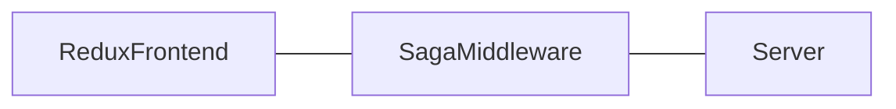

# Overview

## React
React wurde von Facebook entwickelt und ist schön schnlank.

Zur installation muss man folgenden Befehl im Terminal angeben
>npm install react

### Warum React
Zu React gibts es viele Erweiterungen, wodurch das Arbeiten mit React sehr vereinfacht wird.
Außerdem unterstützt React Typescript *als wenn das was Besonderes wäre*.

### Material UI
[MaterialUI](https://material-ui.com/) ist eine fette Bibliothek an **HTML** Elementen für Leute die keinen Plan von Html und Css haben.
Sie verbraucht aber auch eine menge Leistung, also bereite dich drauf vor, dass der Laptoplüfter abgeht.

Zur installation folgender Befehl:
>npm install @material-ui/core

Das ist aber nur das Basis Paket von MaterialUi.

Die Dokumentation zu den einzelnen Elementen ist sehr gut 
und unter folgendem [Link](https://material-ui.com/components/box/) zu finden.

### Axa Styleguide
Der Axa Styleguid ist ein von der Axa vorgegeben, *welch Überraschung*.
Die hier angegebenen Farben sind in der Datei **ColorsSolid.json** zu finden.

>Es empfielt sich diesen vor dem erstellen eines neuen Elemets nocheinmal anzuschauen.

## Saga Middleware
Hier steht Blödsinn zur [Saga Middleware](../middleware/DataFlow.md) die Ebenfals unter diesem Reiter zu finden ist.

##### Datenfluss

>Der Daten Fluss vom Frontend über die Middleware zum Server :


## Server

Hier wird kurz und abstrakt erklährt, wie der Server funktioniert und wozu man ihn braucht

>Weitere Informationenüber kann man im Reiter [Server](/docs/server/Server.md) nachlesen.

###### Code Beispiel:
```javascript
    async function doServerStuff(arg) {
        await startServer();
        await addParamsToServer(arg);
        console.log('Alles gestartet!');
    }
```
