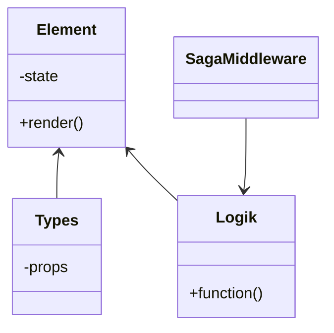

# Aufbau eines Elements mit Typescript

In dem Projekt werden die einzelnen Komponenten immer in 3 Teile aufgespalten

>Das **Element** handelt einzig das Rendern des HTLM Objekts.<br>
>**Types** ist ein Interface das die *interfaces* für das Element und die Logik beinhaltet.<br>
>Die **Logik** bildet die Schnittstelle, zwichen der Middleware und dem Element.



## Element
Das Element behandelt wie oben bereits erwähnt, nur das rendern des HTML Elements.
Über die **Props** die in Types festgelegt sind, wird das aussehen des Elements bestimmt.

>Hier steht nochmal ein kleiner Hinweis zu den Elementen

Und hier steht nochmal etwas ausführlicher, wie man was benutzt.
Hier stehen weitere Sachen, Funktionsweisen und wie es sich sich gedacht wurde.
Alles klar, wenn das verstanden wurde werden wir im folgenden noch deteilreicher auf alles eingehen.
Da es doch noch einige spiezialfälle gibt und auch andere Fälle, bei denen das nicht so wirklich funktioniert.

Am ende noch ein kurzes Codebeispiel
````typescript
interface ElementProps {
  stuff: string;
}

function Button(props: ElementProps) {
    return ("<button>{$value}</button>");
}
````

## Types
Types definiert in jeweils getrennten Interfaces die **Props** sowohl für die Logik als auch für das Element.

Der Code für die Types sieht meist wie folgt aus
````typescript
interface ElementProps {
    text: string;
    isDisabled?: boolean;
    color?: string;
}

interface LogikProps {
    value: string;
    selectedMiddleware: any;
    fallbackValues?: any;
}
````

## Logik
Die Logik bildet den wrapper für das Element. 
Am End wird auch nur ein Objekt von Logik eingebunden, dass dann alles weitere handelt.

>**Wichtig**: Die Logik händelt alles, von funktion bis zum Aussehen der Komponente

Jetzt noch ein Paar Infos zur Logik und wie die zu programmieren ist.
Zudem steht hier auch,<br> wie man die [Saga Middleware](/sagamiddelware/README.md) einbindet und benutzt.
